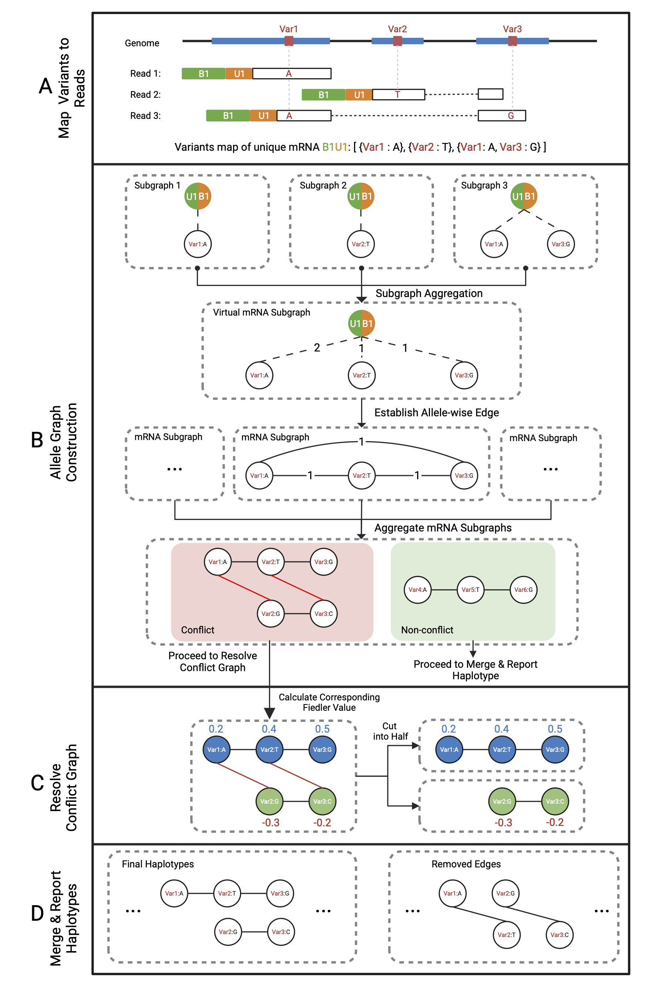

# Sabre - Single-cell reAd-Backed umi-awaRE phasing

## What is Sabre

Single-cell level haplotype phasing is key to studying clonal hematopoiesis, X chromosome inactivation, RNA editing, mitotic recombination, and somatic mutations. The availability and exponential growth of scRNA-seq data represent a vastly untapped resource for read-backed phasing in single cells. Unlike bulk RNA-seq, scRNA-seq’s read structure, high PCR duplication, and low sequencing depth present challenges. We introduce Sabre, a method that accurately infers long-range haplotypes by leveraging the read structure and PCR duplicates unique to scRNA-seq data. Sabre can be utilized in these following three scenarios: 
 * **Germline variants**, where all cells share the same haplotypes; 
 * **Somatic variants**, where haplotypes are shared by mutant cells and their progenies; 
 * **RNA editing variants**, where haplotypes are unique to each cell. Sabre uses ultrafast graph algorithms and is scalable to atlas-scale data with 1M single cells.

 Developed and maintained by [Laurentius](https://github.com/GhostAnderson).

 Runs on `python 3.x`, requires `samtools`, `vcftools`, `bedtools`.

 ## Table of contents
* [Overall Structure](#overall-structure)
* [Installation Instructions](#installation-instructions)
    * [Install from bioconda](#install-from-bioconda-recommended)
    * [Install from pypi](#install-from-pypi)
    * [Install from source code](#install-from-souce-code)
* [Example Usage](#example-usage)
    * [TL;DR](#tldr)
    * [Sabre for scRNA-seq phasing](#sabre-for-scrna-seq-phasng)
    * [Sabre for somatic variant analysis](#sabre-for-somatic-variation-analysis)
    * [Sabre for RNA-editing analysis](#sabre-for-rna-editing-analysis)
* [Options](#options)
    * [General Options](#general-options)
    * [Accuracy & Sensitivity Related Options](#accuracy--sensitivity-related-options)
    * [Output Options](#output-options)
    * [Performance Related Options](#performance-related-options)
* [Citation](#citation)

 ## Overall Structure


 ## Installation Instructions

 ### Install from bioconda (Recommended)
 Using anaconda can assure all the dependencies installed correctly. Sabre can be installed from the *bioconda* channel.
 ```bash
 $ conda install sabre -c bioconda
 ```

 ### Install from pypi
 Installing sabre from pypi requires `samtools`, `tabix`, `bcftools` preinstalled by user.
 ```bash
 $ pip install sabre
 ```

 ### Install from souce code
 The requirement is the same as installing from pypi.
 ```bash
 $ git clone https://github.com/boxiangliulab/Faser-scRNA.git
 $ cd Faser-scRNA
 $ pip install .
 ```

 ## Example Usage

 ### TLDR

 ```bash
 # On all Chromosomes
$ sabre --id <ID> --bam <path-to-bam> --vcf <path-to-vcf> --sample <SAMPLE_NAME> --total_chr <number-of-chrs-without-chrX> --input_type <cellranger/umitools/re> 

 # On one Chromosome
$ sabre --id <ID> --bam <path-to-bam> --vcf <path-to-vcf> --sample <SAMPLE_NAME> --chr <desired_chr> --input_type <cellranger/umitools/re> 
 ```

 ### Sabre for scRNA-seq phasng
----

Requires a VCF and BAM, produces a HAPCUT-style output and a phased VCF with computed haplotype phases and result files containing haplotype details, graph connectivities, and read counts. 

**Install Requirements**
----

Sabre requires multiple libraries of python to run. Good news is, with anaconda installed, you can install them all by simpliy typing 

```bash
$ conda create --name <env> --file requirements.txt
```

**BAM input**
----
 
 Sabre supports BAM files generated by various single-cell alignment/analysing tools e.g. cellranger, star-solo, umitools etc, and multiple filtering parameters on BAM file including alignment score and MAPQ.

 Apart from inputing single BAM file using `--bam <path-to-bam>`, we provided a way to input multiple BAM files at once. This will be helpful when mixing different reads from tissures of a common individual, e.g. normal cells and tumor cells.

 First, you need to prepare a `bam.list` file
 ```python
 #bam.list
 <path-to-bam1>,ID1
 <path-to-bam2>,ID2
 ...
 ```
 and use the argument `--bam_list bam.list`. The `ID` column will be append to cell barcodes from corresponding BAM file.

 We defined cell barcode and UMI style of different softwares as follows:
 ```bash
 #Cellranger
SRR8551677.314853539 ... CB:Z:<Barcodes> UB:Z:<UMI> ...

 #UMI-tools
SRR8551677.236615618_<Barcodes>_<UMI>

#star-solo
<Barcodes>_<UMI>_AAAAAEEEEE_SRR6750053.36514992
 ```
 You shall specify your input type by using `--input-type <cellranger/umitools/star>`.
 
 Noted that the cell barcode and UMI style may change between different versions of the same software, and there may be more styles out of our selected ones, we present you with `--input-type re`, which allows you to use custom regular expressions to extract UMI and cell barcodes.

 For example, given a BAM file, one line of the BAM file show as
 ```
SRR8551677.64678072     16      chr1    14426   1   ...  BC:ACTACTACT UMI:TAGTAGTGA ...
 ```
 The corresponding regular expression for extract cell barcode and UMI from this BAM is
 ```
 --bc_re BC:([AGCT]+) --umi_re UMI:([AGCT]+)
 ```
 Further information of regular expression can be found [here](https://www.w3schools.com/python/python_regex.asp).

We applied multiple threshold on the BAM file to achieve balance between precision and sensitivity, with corresponding argument `--mapq`, `--as_quality` etc. Detailed information can be seen [here](#accuracy--sensitivity-related-options)

**VCF input**
----

Variants pending for phasing are given by VCF files. By providing VCF files using `--vcf`, you should provide the desired sample name in the VCF file with `--sample`.

If there is no ground truth VCF files, nor there is no existing VCF file for an individual. In other words, you only have the bam file. Worry not! You can call variants on your own by 
```bash
$ samtools index <path-to-bam>
$ bcftools mpileup -Ou -f <path-to-genome.fa> <path-to-bam> | bcftools call -mv -Ob -o tmp.bcf
$ bcftools view tmp.bcf -o tmp.vcf
$ bgzip -c tmp.vcf > <your-desired-name>.vcf.gz
$ tabix -p vcf <your-desired-name>.vcf.gz
```
You can perform further filtering on this VCF file or simply indicating `--raw_vcf` and `--vcf_qual <threshold-on-vcf-QUAL>` when using Sabre.

Sometimes, the input chromosome may contain the **"_"** character, e.g. mm10_1. To prevent errors, you need to specify `--sep <any-character-you-like-except-from-_-and-:>`. And in other circumstances, the naming style of given BAM file and VCF file may be different. You can use `--chr_vcf <chr-on-VCF-file>` to specify the desired chromosome in the VCF file.

Sabre assumes diploid for input, thus if there are more than one ALT for a input variant, the default parameters would lead to misleading results. If you consider this as unacceptable, or difference between ALT alleles are important in your study, set `--non_binary_variant`. Therefore the Sabre is provided ability to distinguish between different ALT.

**Output**
----
Typical output consists of a single `chr*.SABRE` file. The format of the `chr*.SABRE` is in consistent with HAPCUT and HapTreeX. A typical block of the `chr*.SABRE` is presented as follow
```csv
...
BLOCK: offset: 249337 len: 2 phased: 2 SPAN: 75 correct: 1
0       1       0       chr20   249337  C       G       0|1
1       0       1       chr20   249412  C       T       1|0
****************
```
From left to right, each corresponding column represents umique_id, allele on one haplotype, allele on the other haplotype, chromosome, position, REF, ALT and GT from the input VCF file.

If you would like to output the phased vcf file, you can specify `--output_vcf`. For the output vcf, we added the following fields to phased variants.

* **PG**: Sabre Local Genotype 
* **PB**: Sabre Local Block
* **PI**: Sabre Local Block Index (unique for each block)

A typical output VCF file would be like:
```
...
chr1    1023775 .       G       A       0       PASS    KM=9.62;KFP=0;KFF=0;MTD=bwa_freebayes,bwa_gatk,bwa_platypus,isaac_strelka       GT:SG:SB:SI     0|1:1|0:chr1_1023775_._G_A;chr1_1023789_._G_C;chr1_1023851_._G_A:47820887733280
chr1    1023789 .       G       C       0       PASS    KM=9.61;KFP=0;KFF=0;MTD=bwa_freebayes,bwa_gatk,bwa_platypus,isaac_strelka       GT:SG:SB:SI     0|1:1|0:chr1_1023775_._G_A;chr1_1023789_._G_C;chr1_1023851_._G_A:47820887733280
...
```

If the output of the ALG and the edge information of it is required, specify `--allele_linkage`. The output of edge linkage information between variants of each cell is outputed in `./output/<id>/cell_allele_connections_chr*.txt`. The typical content of the output file is 

```
barcode var     geno    support
CCACGGAAGACAATAC        chr22_16614653_._C_T,chr22_16614872_._A_T       00      1
TGAGCCGGTTCCCGAG        chr22_16614653_._C_T,chr22_16614872_._A_T       00      1
ACTTACTGTTCCTCCA        chr22_16614653_._C_T,chr22_16614872_._A_T       00      1
...
```

To enable residual graph output, specify `--singular`. The results are stored in `./output/<id>/singular_cells/singular_cell_linkage_*.txt`. The typical content would be like
```
barcode var     geno    support p-value oppo_support    total_covered_barcodes  global_oppo_support     correct is_singular
CCATTCGCAGGATTGG        chr15_22690417_._A_G,chr15_22690362_._A_G       01      1       0.8607110296641832      0       7       5       1       0
CTCAGAAAGGAATTAC        chr15_22690417_._A_G,chr15_22690362_._A_G       01      1       0.8607110296641832      0       7       5       1       0
```
where `support` represents the number of mRNAs supporting this pair of allele in this specified cell barcode. `oppo_support` represents the number of mRNAs in conflict with this pair in this cell barcode. `total_covered_barcodes` represents the number of cells that expressed this two variants. `global_oppo_support` represents the number of mRNAs in conflict with this pair in all cells.

For detailed output, specify `--verbose`.

 ### Sabre for somatic variation analysis
----

To perform somatic variations analysis in the paper, you first need to specify `--output_conflict`.

And to perform **in-phase** and **out-of-phase** detection, run the following command
```bash
# For somatic variation analysis
$ sabre-somatic --id <id> --gtf <path-to-gtf>
```
The script will generate two outputs: 
* in.phase.hits.annotated.csv
* out.of.phase.hits.annotated.csv

A typical example of output is
```Bash
#out.of.phase.hits.annotated.csv
Sample	Var1	Var2	00	01	10	00_cell	01_cell	10_cell	00_raw_count	01_raw_count	10_raw_count	Var1:0	Var1:1	Var2:0	Var2:1	inherit_ratio	somatic_ratio	minor_freq	reads_sum	raw_reads_count_sum	gene
Sample1	chr12_10435855_._A_G	chr12_10435982_._T_C	3	70	14	3	24	13	3	74	14	383	167	186	310	0.125	0.5416667	3	87	91	KLRC2
Sample2	chr12_10435931_._C_G	chr12_10435982_._T_C	21	87	63	20	26	34	52	95	206	478	211	186	310	0.5882352941176471	0.7647059	20	171	353	KLRC2
```
where each line represents a in/out-of-phase variant pair, `00/01/10` represents mRNA count of corresponding variant configuration, and `00/01/10_cell` represents the cell number count. `00/01/10_raw_count` reprensents corresponding read count in the BAM file. `Var0/1:0/1` represents the read depth of each allele.

You should perform further custom filtering to get reliable analysis results.

 ### Sabre for RNA-editing analysis
----

To perform somatic variations analysis in the paper, you first need to specify `--allele_linkage`.

 ## Options

### General Options
* `--id`: A unique run ID string (e.g. sample345).
* `--bam`: Indexed BAM file containing aligned reads.
* `--bam_list`: A list of input BAM files.
* `--vcf`: Input VCF file, must be gzipped and tabix indexed.
* `--sample`: Sample name in VCF.
* `--chr`: To restrict phasing in a given chr on BAM & VCF.
* `--total_chr`: Total chromosome count (without 'X' chromosome) for phasing on all chromosomes 
* `--raw_vcf`: If the vcf is not filtered, and the FILTER column is not 'PASS', specify this option 
* `--sep`: Character used to construct split variant information. Default `_`.
* `--non_binary_variant`: If set, means there may be multiple ALT. for a single variant in the VCF file. Default `false`.
* `--chr_prefix`: Chromosome prefix. Default `chr`.  
* `--chr_vcf`: To restrict phasing in a given chr on VCF, if chromosome is not named equally between BAM and VCF
* `--neglect_hla`: If set, variants in the HLA region is neglected.
* `--seed`: Random seed 
* `--tmp_dir`: Directory of tempfile.
* `--input_type`: How umi-barcode is provided, e.g. cellranger-style, umitools-style or 're' for custom regular expression..
* `--bc_re`: The regular expression for extracting Cell Barcode in the BAM file..
* `--umi_re`: The regular expression for extracting UMI in the BAM file..

### Accuracy & Sensitivity Related Options
* `--mapq_threshold`: Threshold on minimum MAPQ value for input BAM. Reads with MAPQ lower than this value will be ignored.
* `--vcf_qual`: The quality threshold on QUAL during processing raw input VCF file.
* `--interval_threshold`: Edge with allele distance on genome more than this threshold will be ignored. 
* `--method`: Specify graph split method, e.g. mincut, fiedler.
* `--fiedler_threshold`: Nodes with corresponding value in fiedler vector lower than threshold will be removed
* `--shortest_path`: Decide whether activate split_graph_by_common_shortest_path..
* `--remove_node`: Activate when `--shortest_path` is set. Remove no more than $remove_node$ in split_graph_by_common_shortest_path()
* `--as_quality`: A filter on alignment score in BAM files.
* `--edge_threshold`: A filter on low confidence edges on graph.

### Output Options
* `--verbose`: Determine whether output conflicted graphs.
* `--output_conflict`: Decide whether to output conflict graphs.
* `--singular`: Decide whether perform singular cell detection.
* `--allele_linkage`: Decide whether output allele linkage count.
* `--output_vcf`: Decide whether output vcf or not (severe performance decrease).

### Performance Related Options
* `--thread`: Number of thread number for multiprocessing. Default `8`. 

 ## Citation

Not published yet. 😭